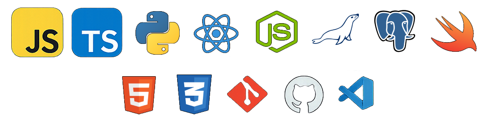

  

<h2 align="center">Digital development with creative care</h2>

<i>
  Building polished apps, clean UI, and interactive experiences.
</i>

---

## About Me

Fullstack developer with a background in graphic design, focused on building digital projects that bring together technical structure and creative thinking.

Currently developing portfolio-ready applications with both frontend and backend components, while refining my skills in JavaScript, TypeScript, Python, React, and application architecture.

Interested in thoughtful interfaces, polished user experiences, and creating work that feels both functional and well crafted.

Always learning, building, and improving.

## Tech I work with

  

| Frontend&nbsp;&nbsp;&nbsp;&nbsp; | Backend&nbsp;&nbsp;&nbsp;&nbsp; | Tools&nbsp;&nbsp;&nbsp;&nbsp; |
| --- | --- | --- |
| HTML | Node.js | Git |
| CSS | Python | GitHub |
| JavaScript | PostgreSQL | VS Code |
| TypeScript | MariaDB |  |
| React | Swift |  |
## Also worked with

  

  Express · PHP · MySQL · Moodle · WordPress · Tailwind CSS

## 🔧 Featured Projects

### 🧠 **QuestDHD**  
*ADHD / Gamified productivity*   
`adhd | gamification | productivity | react | nodejs | fullstack | tfg | portfolio`  
Gamified productivity app designed to help users with ADHD stay focused and motivated.

---

### 🧰 **BenriServ**  
*Maintenance / Technical management* 

`maintenance | management | nodejs | react | fullstack | tfg | portfolio | webapp`  
A unified web app for incident reporting, technician assignment, and maintenance tracking.

---

### 💘 **Once Upon a Tale**  
*Visual novel / Original otome project*  
`otome | visual-novel | renpy | narrative | game-dev | portfolio`  
Original fantasy visual novel project exploring choice, emotion, and world-building.

---

## 🌐 Find me around the web

- 📸 [Instagram](https://instagram.com/byneriai)
- 🎮 [Itch.io](https://nerineaoi.itch.io)
- 💬 [X / Twitter](https://x.com/byneriaoi)
- 🐙 [GitHub](https://github.com/nerineaoi)
