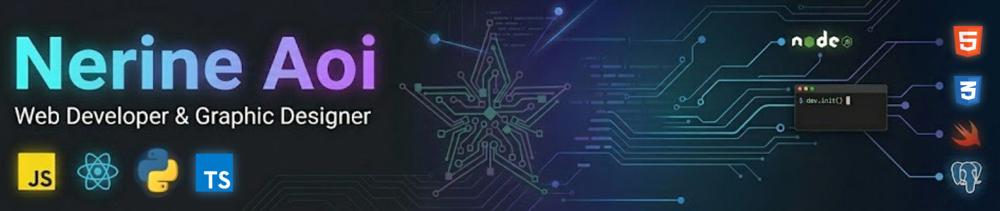

  

<h2 align="center">Digital development with creative care</h2>

<i>
  Building polished apps, clean UI, and interactive experiences.
</i>

---

## About Me

Fullstack developer with a background in graphic design, focused on building digital projects that bring together technical structure and creative thinking.

Currently developing portfolio-ready applications with both frontend and backend components, while refining my skills in JavaScript, TypeScript, Python, React, and application architecture.

Interested in thoughtful interfaces, polished user experiences, and creating work that feels both functional and well crafted.

Always learning, building, and improving.

---

## Tech I work with

  

  <strong>Frontend:</strong> HTML · CSS · JavaScript · TypeScript · React · Tailwind

  <strong>Backend:</strong> PHP · Node.js · Python · PostgreSQL · Swift

  <strong>Tools:</strong> Git · GitHub · VS Code

## Additional tools

  

  <strong>Backend:</strong> Express · Java · MySQL · SQLite 

  <strong>Design & Creative:</strong> Figma · Photoshop · Premiere Pro · After Effects

  <strong>Platforms & Tools:</strong> Wordpress · Eclipse · Ubuntu · Unity 
  

### Also worked with

  Moodle · DataFlex · Tkinter · Ren'Py · MariaDB · Mermaid · Paint Tool SAI 2 · Wondershare

---

## Featured Projects

### Web Apps

#### 🗓️ Sesvia  
*Appointment and payment management platform*

  

  

A full-stack web application designed to handle bookings, availability, payments, and client communication through a structured workflow for both professionals and clients.

**Stack:** HTML · CSS · JavaScript · Bootstrap · Python · FastAPI · SQLite / PostgreSQL   
**Focus:** Booking flow · Availability control · Payment handling · Client/professional dashboard logic

- 📅 Booking and availability management
- 💳 Payment and billing workflow
- 👥 Separate flows for clients and professionals

  

────────────────────────────────────────

#### 🧰 BenriServ 🚧 
*Maintenance and technical management web app*

A full-stack web application for incident reporting, technician assignment, and maintenance tracking, designed to streamline communication between clients and service professionals.

**Stack:** React · Node.js    
**Focus:** Incident reporting · Assignment workflow · Maintenance tracking

- 📝 Incident reporting and status tracking
- 🧑‍🔧 Technician assignment workflow
- 🔧 Maintenance follow-up and management

  

### Desktop App

#### 💬 CarriComms 🚧
*Multi-platform communication dashboard*

  

A desktop communication tool designed to centralize messages, monitor connection health, and improve visibility across multiple channels for creators and community management workflows.

**Stack:** Python · Tkinter  
**Focus:** Unified inbox · Connection monitoring · Supporter message visibility

  

### Websites

#### BYNERIAOI  

Live creative portfolio site for illustration, design, and personal branding.

**Stack:** HTML · CSS · JavaScript

  

────────────────────────────────────────

#### NERI-CORE 🚧

Developer website and portfolio currently under construction. 

**Stack:** HTML · CSS · JavaScript

  

### Visual Novels

#### 🌙 Once Upon a Tale
*Narrative-driven otome visual novel*

  

A story-rich visual novel project built around branching routes, emotional character arcs, and immersive worldbuilding, combining interactive storytelling with a strong visual and narrative identity.

**Stack:** Ren’Py · Python  
**Focus:** Narrative design · Branching routes · Worldbuilding

  

#### 💘 Cupid Hex
*Romantic visual novel project*

  

A romance-focused visual novel project exploring interactive storytelling, character dynamics, and stylized narrative design through a more playful concept.

**Stack:** Ren’Py · Python  
**Focus:** Interactive storytelling · Romance systems · Character-driven design

  

## Currently working on

- Strengthening my full-stack workflow across frontend and backend projects
- Building NERI-CORE, my developer website and portfolio
- Developing UI, branding, and structure for portfolio-ready applications
- Exploring product and concept design through side projects like QuestDHD

## Contributions

  

  

  

## Find me around the web

  
  

  
  

